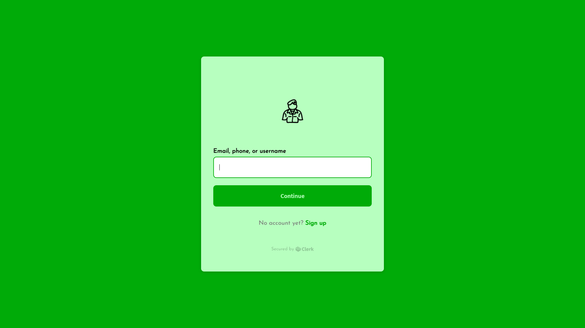

<h1 align="center">
  <br>
  <a href="https://paradestate-public.herokuapp.com/"></a>
  <br>
    Parade State
  <br>
</h1>

<h4 align="center">A minimal Nominal Roll & Attendance Tracking Editor web application built on top of <a href="https://create-react-app.dev/" target="_blank">Create React App</a>.</h4>

<p align="center">
  <a href="#key-features">Key Features</a> •
  <a href="#how-to-use">How To Use</a> •
  <a href="#credits">Credits</a> •
  <a href="#license">License</a>
</p>



## Key Features

* LivePreview - Make changes, See changes
  - Instantly see your present strength and attendance as you create and update them.
* Flavored with Atomise UI
* Authentication with Clerk
* Full screen mode
  - Update and edit distraction free.
* Web Progressive App mode
  - Add to your home screen and use it just like a mobile application.

## How To Use

To clone and run this application locally, you'll need [Git](https://git-scm.com) and [Node.js](https://nodejs.org/en/download/) (which comes with [npm](http://npmjs.com)) installed on your computer. From your command line:

```bash
# Clone this repository
$ git clone https://github.com/nicholasohjj/paradestate-public

# Go into the repository
$ cd paradestate-public

# Install dependencies
$ npm install

# Run the app
$ npm start 
```

Note: If you're using Linux Bash for Windows, [see this guide](https://www.howtogeek.com/261575/how-to-run-graphical-linux-desktop-applications-from-windows-10s-bash-shell/) or use `node` from the command prompt.


## Preview

You can [preview](https://paradestate-public.herokuapp.com/) a public version of Parade State for Chrome, Microsoft Edge and Firefox here.

## Credits

This application uses the following open source packages:

- [Create React App](https://create-react-app.dev/)
- [Node.js](https://nodejs.org/)
- [Atomise UI](https://atomizecode.com/)
- [Clerk](https://clerk.dev/)


The sample application deployed to the internet uses the following:

- [Heroku](https://www.heroku.com/)
- [MongoDB](https://www.mongodb.com/)

Application Logo made with:

- [Adobe Spark](https://spark.adobe.com/sp/)

## License

MIT

---

> GitHub [@nicholasohjj](https://github.com/nicholasohjj) &nbsp;&middot;&nbsp;
> Linkedin [@nicholasohjj](https://www.linkedin.com/in/nicholasohjj)

